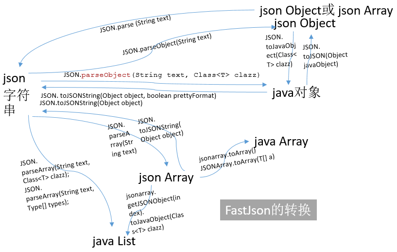

# gradle-demo-1


1. [gradle 使用 lombok](https://cloud.tencent.com/developer/article/1480194) 

## 其他使用

### JSON
#### Jackson
1. [jackson入门](https://blog.csdn.net/u011054333/article/details/80504154)

###### Jackson 一般用法

#### FastJSON
> parseXXX 从 json字符串到json对象或Java对象  
> toJSONString() 从 json对象或Java对象到json 字符串



###### 常用方法

1.Fastjson中的经常调用的方法:

``` 
public static final Object parse(String text); 　　// 把JSON文本parse为JSONObject或者JSONArray 

public static final JSONObject parseObject(String text)；　　 // 把JSON文本parse成JSONObject 

public static final T parseObject(String text, Class clazz); 　　// 把JSON文本parse为JavaBean 

public static final JSONArray parseArray(String text); 　　// 把JSON文本parse成JSONArray 

public static final List parseArray(String text, Class clazz); 　　//把JSON文本parse成JavaBean集合 

public static final String toJSONString(Object object); 　　// 将JavaBean序列化为JSON文本 

public static final String toJSONString(Object object, boolean prettyFormat); 　　// 将JavaBean序列化为带格式的JSON文本 

public static final Object toJSON(Object javaObject); 　　//将JavaBean转换为JSONObject或者JSONArray。
```

2.Fastjson字符串转List<Map<String,Object>>(), 或者List<String>()的用法;

```
List<Map<String, Object>> list = JSONObject.parseObject(respJson, new TypeReference<List<Map<String, Object>>>() {});
```

###### SerializerFeature常用属性
```
public static String toJSONString(Object object, SerializerFeature... features)
```

例如：`JSON.toJSONString(resultMap, SerializerFeature.WiteMapNullValue);`


```
QuoteFieldNames---输出key时是否使用双引号,默认为true
UseSingleQuotes---使用单引号而不是双引号,默认为false
UseISO8601DateFormat---Date使用ISO8601格式输出，默认为false
WriteMapNullValue---是否输出值为null的字段,默认为false
WriteEnumUsingToString---Enum输出name()或者original,默认为false
WriteNullListAsEmpty---List字段如果为null,输出为[],而非null
WriteNullStringAsEmpty---字符类型字段如果为null,输出为”“,而非null
WriteNullNumberAsZero---数值字段如果为null,输出为0,而非null
WriteNullBooleanAsFalse---Boolean字段如果为null,输出为false,而非null
SkipTransientField---如果是true，类中的Get方法对应的Field是transient，序列化时将会被忽略。默认为true
SortField---按字段名称排序后输出。默认为false
WriteTabAsSpecial---把\t做转义输出，默认为false不推荐设为true
PrettyFormat---结果是否格式化,默认为false
WriteClassName---序列化时写入类型信息，默认为false。反序列化是需用到
DisableCircularReferenceDetect---消除对同一对象循环引用的问题，默认为false
WriteSlashAsSpecial---对斜杠’/’进行转义
BrowserCompatible---将中文都会序列化为\uXXXX格式，字节数会多一些，但是能兼容IE 6，默认为false
WriteDateUseDateFormat---全局修改日期格式,默认为false。
DisableCheckSpecialChar---一个对象的字符串属性中如果有特殊字符如双引号，将会在转成json时带有反斜杠转移符。如果不需要转义，可以使用这个属性。默认为false
BeanToArray---将对象转为array输出	
```

#### FastJSON 一般用法

###### JSONField与JSONType注解的使用

###### 参考
1. [Fastjson 简明教程](https://www.runoob.com/w3cnote/fastjson-intro.html)
1. [fastjson 教程](https://www.w3cschool.cn/fastjson/)    
1. [fastjson详解](https://www.jianshu.com/p/eaeaa5dce258)
    